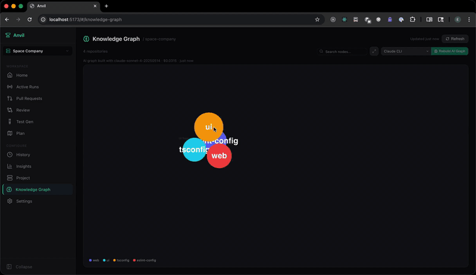
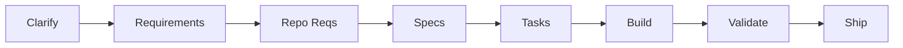

<div align="center">

# Anvil

**AI agents that ship features across multi-repo codebases**

[](https://github.com/esanmohammad/Anvil)
[](LICENSE)
[](https://modelcontextprotocol.io)
[]()

[Pipeline](#anvil-pipeline) · [Code Search](#code-search-mcp) · [Quick Start](#quick-start) · [Docs](#configuration) · [Demo](https://drive.google.com/file/d/1xsJWrYI5C6aaoE5_n4DbOTaFie1L2d7G/view?usp=drive_link)

<br />

[](https://drive.google.com/file/d/1xsJWrYI5C6aaoE5_n4DbOTaFie1L2d7G/view?usp=drive_link)

_Click the gif to watch the full demo_

</div>

---

<table>
<tr>
<td width="50%" valign="top">

### Anvil Pipeline

**Describe a feature -- get PRs across all repos.**

An 8-stage pipeline driven by AI agents with full architectural awareness: AST-parsed knowledge graphs, cross-repo dependency detection, convention learning, and cost-controlled model routing.

[Get started](#quick-start)

</td>
<td width="50%" valign="top">

### Code Search MCP

**11 MCP tools for any AI client.**

A standalone MCP server that gives Claude Code, Cursor, or any MCP client semantic search, dependency graphs, cross-repo analysis, and impact tracing over your codebase.

[Get started](#code-search-mcp)

</td>
</tr>
</table>

---

## Quick Start

```bash
git clone https://github.com/esanmohammad/Anvil.git && cd anvil
npm install && npm run build --workspaces
anvil doctor
anvil dashboard
```

Open `http://localhost:5173`, select your project, and describe what you want to build.

- **Node.js >= 20**
- **git** and **gh** (GitHub CLI) for PR creation
- **Claude CLI** (`npm i -g @anthropic-ai/claude-code`) -- primary agent provider
- **Gemini CLI** (optional) -- alternative provider

---

## Anvil Pipeline

**Describe a feature. Anvil clarifies, plans, codes, tests, and opens PRs -- across every repo in your project.**



| Stage | What happens |
|:--|:--|
| **Clarify** | Agent explores the codebase, asks targeted questions, you answer in the dashboard |
| **Requirements** | High-level cross-repo plan: architecture, scope, success criteria |
| **Repo Requirements** | Per-repo breakdown with data flows, API changes, inter-service deps |
| **Specs** | Technical specs per repo: API contracts, schemas, migrations |
| **Tasks** | Granular implementation tasks with file-level scope and execution order |
| **Build** | Agents write code on feature branches, parallel across independent repos |
| **Validate** | Build, lint, test -- automatic fix loop (up to 5 iterations) |
| **Ship** | Commit, push, open cross-linked PRs on GitHub |

Each stage is checkpointed to `~/.anvil/features/`. Six agent personas (Clarifier, Architect, Analyst, Engineer, Tester, Lead) are assigned per stage. Model routing uses cost tiers -- $/$$/$$$ -- overridable per stage in `factory.yaml`.

---

## Key Features

<table>
<tr>
<td width="50%" valign="top">

**Knowledge Graph**

AST parsing extracts functions, classes, imports, and relationships into `graph.json` per repo. 14 cross-repo edge detection strategies cover npm workspaces, shared types, HTTP routes, Kafka topics, gRPC services, database tables, and more. Interactive force-directed visualization in the dashboard.

</td>
<td width="50%" valign="top">

**Memory and Learning**

Auto-learns from successes, failures, and fix patterns after every pipeline run. Project memory and user profile persist across runs and are injected into agent prompts, so future runs improve without manual tuning.

</td>
</tr>
<tr>
<td width="50%" valign="top">

**Resilience and Recovery**

Every stage is checkpointed. Resume after crash, sleep, budget hit, or manual stop -- full context restored. Interrupted pipelines appear in Active Runs on dashboard restart.

</td>
<td width="50%" valign="top">

**Convention Detection**

Automatically extracts file naming patterns, test conventions, import ordering, and error handling styles. Rules graduate from detected to validated to enforced as confidence increases.

</td>
</tr>
<tr>
<td width="50%" valign="top">

**Budget Controls**

Per-run and daily spend limits with browser notifications. Pipeline pauses cleanly when limits are hit and resumes after budget reset.

</td>
<td width="50%" valign="top">

**Auth Recovery**

If your LLM provider auth expires mid-pipeline, the pipeline pauses, sends a browser notification, auto-opens re-login, and resumes once authenticated. No lost work.

</td>
</tr>
</table>

---

## Code Search MCP

A standalone MCP server that gives any MCP client deep understanding of your codebase. Point it at a directory or GitHub org -- it discovers repos, parses code with tree-sitter, builds vector embeddings, constructs AST graphs, and detects cross-repo dependencies.

**Install for Claude Code:**

```bash
claude mcp add code-search -- npx @anvil-dev/code-search-mcp --local /path/to/repos
```

**Tool categories:**

Search: `search_code`, `search_semantic`, `search_exact` | Graph: `get_repo_graph`, `get_cross_repo_edges` | Navigation: `find_callers`, `find_dependencies`, `impact_analysis` | Info: `list_repos`, `get_repo_profile`, `index_status`

Full docs: [`packages/code-search-mcp/README.md`](packages/code-search-mcp/README.md)

---

## Privacy

**Zero telemetry. Zero logging. Zero phone-home.**

- Fully local -- dashboard, pipeline, knowledge graph, and indexing all run on your machine
- You choose the LLM -- your code only goes to the provider you explicitly select
- Open source MIT -- every line auditable, no obfuscated binaries

---

## Configuration

A single `factory.yaml` in `~/.anvil/projects/<name>/` configures the pipeline:

```yaml
version: 1
project: my-platform
workspace: ~/workspace/my-platform

repos:
  - name: api-gateway
    path: ./api-gateway
    language: go
    github: myorg/api-gateway
    commands:
      build: make build
      test: make test

budget:
  max_per_run: 50
  max_per_day: 150

pipeline:
  models:
    clarify: claude-sonnet-4-6
    build: claude-sonnet-4-6
```

Providers: **Claude CLI** (up to 1M context on Opus 4.7 / Sonnet 4.6 / Opus 4.6, 200K on Haiku 4.5) and **Gemini CLI** (1M context). Both run full tool use. Additional providers planned.

Context windows are resolved per-model via a family-rule catalog (`packages/dashboard/server/model-catalog.ts`) — no per-version hardcoding. Override any model with `ANVIL_CONTEXT_WINDOW_<MODEL_ID>=<tokens>` if you're on a custom endpoint.

| Command | Description |
|:--|:--|
| `anvil init` | Scaffold a new project with `factory.yaml` |
| `anvil doctor` | Check Node.js, git, gh, and provider availability |
| `anvil dashboard` | Launch the web dashboard |

---

## Contributing

```bash
git clone https://github.com/esanmohammad/Anvil.git && cd anvil
npm install && npm run build --workspaces
cd packages/dashboard && npm run dev      # dashboard dev mode
cd packages/code-search-mcp && node build.mjs  # build MCP server
```

## Packages

| Package | Description |
|:--|:--|
| `@anvil-dev/cli` | CLI -- `anvil init`, `anvil doctor`, `anvil dashboard` |
| `@anvil-dev/dashboard` | React dashboard + Node.js server -- pipeline orchestration |
| `@anvil-dev/code-search-mcp` | Standalone MCP server for multi-repo code search |

## License

MIT -- Copyright (c) 2024-2026 Esan Mohammad

<div align="center">

Built with [TypeScript](https://www.typescriptlang.org/) | [React](https://react.dev/) | [Tree-sitter](https://tree-sitter.github.io/) | [LanceDB](https://lancedb.com/) | [Graphology](https://graphology.github.io/)

[Issues](https://github.com/esanmohammad/Anvil/issues) · [Discussions](https://github.com/esanmohammad/Anvil/discussions)

</div>
