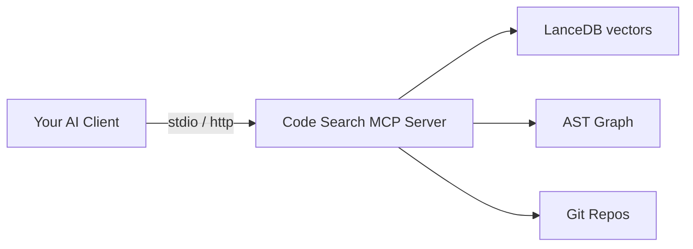

<div align="center">

<br/>

# Code Search MCP

**Multi-repo code intelligence via the Model Context Protocol**

[](../../LICENSE)
[](https://modelcontextprotocol.io)
[]()
[]()

[Quick Start](#quick-start) · [Tools](#tools) · [Deploy](#deployment) · [Configuration](#configuration)

</div>

---

## What You Get

Ask questions in natural language. The server searches, traces, and analyzes across all your repos.

| Query | Tool | Result |
|:------|:-----|:-------|
| "How does authentication work across services?" | `search_code` | 8 results from 3 repos, ranked by relevance |
| "What calls handlePayment?" | `find_callers` | 12 call sites traced across api-gateway and billing-service |
| "If I change user.ts, what breaks?" | `impact_analysis` | 4 files in 2 repos identified as affected |

Works with Claude Code, Claude Desktop, Cursor, and any MCP client.

---

## Architecture



---

## Quick Start

<details open>
<summary><strong>Local mode</strong> -- run on your machine</summary>

```bash
claude mcp add code-search -- npx @anvil-dev/code-search-mcp --local /path/to/repos
```

For GitHub orgs:

```bash
claude mcp add code-search -- npx @anvil-dev/code-search-mcp --local github:your-org --token ghp_xxx
```

</details>

<details>
<summary><strong>Connect to a team server</strong></summary>

**Claude Code:**

```bash
claude mcp add code-search \
  -e CODE_SEARCH_SERVER=https://your-server:3100 \
  -e CODE_SEARCH_API_KEY=your-api-key \
  -- npx @anvil-dev/code-search-mcp
```

**Claude Desktop / Cursor (JSON config):**

```json
{
  "mcpServers": {
    "code-search": {
      "command": "code-search-mcp",
      "env": {
        "CODE_SEARCH_SERVER": "https://your-server:3100",
        "CODE_SEARCH_API_KEY": "your-api-key"
      }
    }
  }
}
```

</details>

<details>
<summary><strong>Deploy the server</strong> (Docker)</summary>

```bash
cp .env.example .env
docker compose up
```

Index repos via the admin API (no restart needed):

```bash
curl -X POST http://localhost:3100/index \
  -H 'Content-Type: application/json' \
  -d '{"path": "/repos/my-service", "project": "my-project"}'
```

Enable automatic reindexing:

```bash
CODE_SEARCH_REINDEX_INTERVAL=1h   # 0 = disabled (default)
```

</details>

---

## Tools

**Search** -- `search_code` · `search_semantic` · `search_exact`
Hybrid vector+BM25, semantic-only, and keyword search across all indexed repos.

**Graph** -- `get_repo_graph` · `find_callers` · `find_dependencies` · `impact_analysis` · `get_cross_repo_edges`
AST knowledge graph, caller tracing, dependency lookup, change impact, and cross-repo connections.

**Profiles** -- `list_repos` · `get_repo_profile`
Indexed repo listing and LLM-generated repo profiles with role, stack, and endpoints.

**Index** -- `index_status`
Chunk count, embedding provider, repo list, and last-indexed timestamp.

### Server Admin API

| Endpoint | Description |
|:---------|:------------|
| `POST /index` | Index repos at a path. Body: `{"path": "...", "project": "...", "force": false}` |
| `GET /health` | Server status, active sessions, index readiness |
| `GET /status` | Live indexing progress, phase, percent, history |

---

## Under the Hood

<details>
<summary>Incremental Indexing -- 4-layer cost optimization</summary>

| Layer | Scope | What it does |
|:------|:------|:-------------|
| 1. Git SHA skip | Repo | Compares HEAD against last indexed SHA; skips unchanged repos |
| 2. Git diff via Merkle DAG | File | Only processes added/modified/deleted files from `git diff` |
| 3. Content hash SHA-256 | File | Fallback dedup when git diff is unavailable |
| 4. Embedding diff against LanceDB | Chunk | Only new/changed chunks sent to the embedding provider |

**Before:** 2 files changed out of 1,000 -- re-embed all 1,000 chunks.
**After:** 2 files changed -- 5 chunks re-embedded, 995 preserved.

Scheduled reindexing (`CODE_SEARCH_REINDEX_INTERVAL=1h`) is practical even with paid providers -- most runs complete in seconds with zero API calls.

</details>

<details>
<summary>Embedding Providers</summary>

| Provider | Env var | Model |
|:---------|:--------|:------|
| Ollama (local, free) | `OLLAMA_HOST` | `bge-m3` |
| Mistral / Codestral | `MISTRAL_API_KEY` | `codestral-embed-2505` |
| OpenAI | `OPENAI_API_KEY` | `text-embedding-3-large` |
| Voyage AI | `VOYAGE_API_KEY` | `voyage-code-3` |
| Gemini | OAuth via `~/.gemini/` | `text-embedding-004` |
| Any OpenAI-compatible | `CODE_SEARCH_EMBEDDING_BASE_URL` | Custom |

**Bring Your Own Provider** -- any service with an OpenAI-compatible `/v1/embeddings` endpoint:

```bash
CODE_SEARCH_EMBEDDING_PROVIDER=custom
CODE_SEARCH_EMBEDDING_BASE_URL=https://api.together.xyz
CODE_SEARCH_EMBEDDING_MODEL=togethercomputer/m2-bert-80M-8k-retrieval
CODE_SEARCH_EMBEDDING_API_KEY=your-key
```

</details>

<details>
<summary>LLM Configuration -- repo profiling and service mesh inference</summary>

The server uses an LLM for repo profiling and service mesh detection. Mode is auto-detected:

- API key present -- `api` mode
- Claude CLI available -- `cli` mode
- Neither -- `none` (LLM features disabled)

Override with environment variables:

```bash
CODE_SEARCH_LLM_MODE=api          # api | cli | none
CODE_SEARCH_LLM_API_KEY=sk-...
CODE_SEARCH_LLM_PROVIDER=anthropic # anthropic | openai | ollama | custom
```

</details>

<details>
<summary>Cross-Repo Detection -- 14 automatic strategies</summary>

npm dependencies, TypeScript shared types, HTTP route matching, Kafka topics, gRPC services, database tables, environment variables, Docker Compose links, Redis keys, S3 buckets, protobuf imports, shared constants, API schemas (OpenAPI/Swagger), and Kubernetes service references.

</details>

<details>
<summary>Supported Languages</summary>

**Tree-sitter AST parsing:** TypeScript, JavaScript, Go, Python, Rust, Java, PHP, C/C++

All other text files are indexed with BM25 keyword search.

</details>

<details>
<summary>Monitoring -- GET /status</summary>

```json
{
  "indexing": {
    "status": "indexing",
    "phase": "embedding",
    "message": "Embedding: 12/15 new (~3s remaining)",
    "percent": 85,
    "elapsedMs": 4200,
    "lastSuccess": "2026-04-18T14:30:00Z",
    "lastDurationMs": 8500,
    "history": [
      {"type": "start", "message": "auto-reindex: started..."},
      {"type": "complete", "message": "Completed: 1200 chunks, 4 repos in 8s"}
    ]
  }
}
```

</details>

---

## Configuration

### Essential

| Variable | Role | Description |
|:---------|:-----|:------------|
| `CODE_SEARCH_SERVER` | Client | Remote server URL |
| `CODE_SEARCH_API_KEY` | Client | API key for remote server |
| `CODE_SEARCH_EMBEDDING_PROVIDER` | Server | `auto` \| `codestral` \| `openai` \| `voyage` \| `ollama` \| `custom` |
| `CODE_SEARCH_LLM_API_KEY` | Server | API key for LLM provider (repo profiling, service mesh) |
| `CODE_SEARCH_AUTH_MODE` | Server | `none` \| `api-key` \| `jwt` |

<details>
<summary>Full Configuration Reference</summary>

**Server CLI flags:**

```
code-search-mcp --serve [options]
  --port <port>        HTTP port (default: 3100)
  --auth <mode>        none | api-key | jwt
  --transport <mode>   streamable-http | sse

code-search-mcp --local [source] [options]
  --project <name>     Project name (default: derived from source)
  --token <token>      GitHub token (or GITHUB_TOKEN env)
  --force              Force full re-index
```

**All environment variables:**

| Variable | Description | Default |
|:---------|:------------|:--------|
| `CODE_SEARCH_TRANSPORT` | Transport mode | `streamable-http` |
| `CODE_SEARCH_PORT` | HTTP port | `3100` |
| `CODE_SEARCH_HOST` | Bind address | `0.0.0.0` |
| `CODE_SEARCH_AUTH_MODE` | Auth mode | `none` |
| `CODE_SEARCH_AUTH_API_KEYS` | Comma-separated API keys | -- |
| `CODE_SEARCH_AUTH_JWT_SECRET` | JWT signing secret | -- |
| `CODE_SEARCH_EMBEDDING_PROVIDER` | Embedding provider | `auto` |
| `CODE_SEARCH_EMBEDDING_API_KEY` | Unified embedding API key | -- |
| `CODE_SEARCH_EMBEDDING_BASE_URL` | Custom embedding endpoint | -- |
| `CODE_SEARCH_EMBEDDING_MODEL` | Custom embedding model | -- |
| `CODE_SEARCH_RERANKER_PROVIDER` | `ollama` \| `cohere` \| `voyage` \| `custom` \| `none` | `ollama` |
| `CODE_SEARCH_RERANKER_BASE_URL` | Custom reranker endpoint | -- |
| `CODE_SEARCH_RERANKER_MODEL` | Custom reranker model | -- |
| `CODE_SEARCH_DATA_DIR` | Data directory override | -- |
| `CODE_SEARCH_REINDEX_INTERVAL` | Auto-reindex schedule (`30m`, `1h`, `6h`, `0`) | `0` |
| `CODE_SEARCH_RATE_LIMIT_PER_MINUTE` | Rate limit per identity | `100` |
| `CODE_SEARCH_LLM_MODE` | `cli` \| `api` \| `none` | `cli` |
| `CODE_SEARCH_LLM_PROVIDER` | `anthropic` \| `openai` \| `ollama` \| `custom` | `anthropic` |
| `CODE_SEARCH_LLM_API_KEY` | API key for LLM provider | -- |
| `CODE_SEARCH_LLM_MODEL` | Model for profiling + service mesh | `claude-sonnet-4-6` |
| `CODE_SEARCH_LLM_BASE_URL` | Custom LLM endpoint | -- |

</details>

---

## Requirements

- **Node.js >= 20**
- One embedding provider: Ollama (free, local) or any supported API key

```bash
# Recommended: Ollama for free local embeddings
brew install ollama && ollama pull bge-m3
```

### Authentication Modes

| Mode | How it works |
|:-----|:-------------|
| `none` | No auth -- process boundary is the security boundary (default for stdio) |
| `api-key` | `Authorization: Bearer <key>` checked against allowlist |
| `jwt` | HS256 JWT verification with expiry and issuer validation |

---

## License

MIT

<div align="center">
<br/>

Built with [Model Context Protocol](https://modelcontextprotocol.io) · [LanceDB](https://lancedb.com) · [Tree-sitter](https://tree-sitter.github.io) · [Graphology](https://graphology.github.io)

</div>
